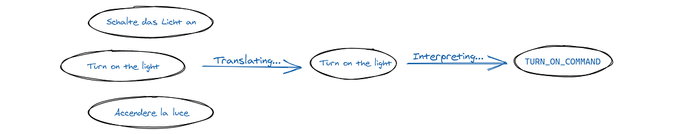
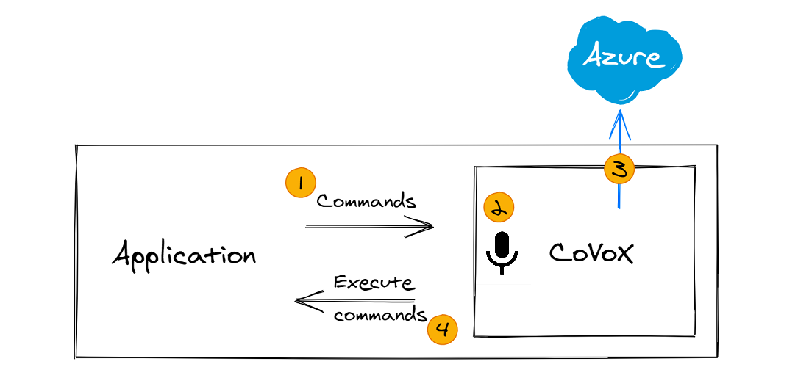

# CoVoX 
**Cloud enabled library providing a customizable voice-interface for your application or your device**

Covox allows the interaction with an application or device through voice.
You provide a list of _Commands_, i.e. operations that can be invoked via the voice interface,
Covox then listens to the audio and when a command matches with the spoken words, it's executed.
It also has multi-language support!

With some imagination, you could control a calculator, or a virtual assistant, or even CRM application!

## How it works
Download the library and provide to it your own [Azure Cognitive Services](https://azure.microsoft.com/en-us/services/cognitive-services/?&ef_id=CjwKCAiAsOmABhAwEiwAEBR0ZnGHrvlWX0UGTbsmNt_o3jMSn2l-AiDqIeSMrQ-J2BgRJDmhTMrVgBoCjgoQAvD_BwE:G:s&OCID=AID2100063_SEM_CjwKCAiAsOmABhAwEiwAEBR0ZnGHrvlWX0UGTbsmNt_o3jMSn2l-AiDqIeSMrQ-J2BgRJDmhTMrVgBoCjgoQAvD_BwE:G:s) subscription key. (If you don't know how, follow this [guideline](https://azure.microsoft.com/en-us/try/cognitive-services/)).

1) Define commands and provide them to Covox
2) Start the audio capture by calling the method `Covox.Run`
3) Covox will use [Azure Cognitive Services](https://azure.microsoft.com/en-us/services/cognitive-services/?&ef_id=CjwKCAiAsOmABhAwEiwAEBR0ZnGHrvlWX0UGTbsmNt_o3jMSn2l-AiDqIeSMrQ-J2BgRJDmhTMrVgBoCjgoQAvD_BwE:G:s&OCID=AID2100063_SEM_CjwKCAiAsOmABhAwEiwAEBR0ZnGHrvlWX0UGTbsmNt_o3jMSn2l-AiDqIeSMrQ-J2BgRJDmhTMrVgBoCjgoQAvD_BwE:G:s) and will emit the event `OnCommandDetected` when something matches one of your commands.
4) Execute the logic connected to the detected command.

## The Engine
Covox is a library you can use in your own application. It orchestrates for you the usage of the [Azure Cognitive Services](https://azure.microsoft.com/en-us/services/cognitive-services/?&ef_id=CjwKCAiAsOmABhAwEiwAEBR0ZnGHrvlWX0UGTbsmNt_o3jMSn2l-AiDqIeSMrQ-J2BgRJDmhTMrVgBoCjgoQAvD_BwE:G:s&OCID=AID2100063_SEM_CjwKCAiAsOmABhAwEiwAEBR0ZnGHrvlWX0UGTbsmNt_o3jMSn2l-AiDqIeSMrQ-J2BgRJDmhTMrVgBoCjgoQAvD_BwE:G:s), enabling your application to convert voice instructions into actions or intents defined by you.

The engine follow these stages:

1) **listening:** translates voice into text 
   using [Speech to Text](https://azure.microsoft.com/en-us/services/cognitive-services/speech-to-text/)

2) **translating:** allows the user to speak in any language, by transforming the sentence into a base language (english) 
   using [Text Translation](https://azure.microsoft.com/en-us/services/cognitive-services/translator) 
   using [Speech Translation](https://azure.microsoft.com/en-us/services/cognitive-services/speech-translation/)

3) **understanding:** matches the intent to an available command given the current context 
   using [Language Understanding](https://azure.microsoft.com/en-us/services/cognitive-services/language-understanding-intelligent-service/)

4) **executing:** returns to you the matching command

## Sample

Taking a simple usecase (light switch application): the client application must use Covox and configure it with a set of commands (i.e. switch on the light, switch off the light). Each of the commands will have a unique identifier and a set of voice triggers.

| Identifier       |      Voice Triggers
|------------------|:------------------------------------------:
| COMMAND_TURN_ON  |  Switch on the light, Turn on light ...
| COMMAND_TURN_OFF |    Switch off the light, Turn off light ...

The application starts the Covox engine audio recognition that listens for voice triggers.
When Covox detects that a voice trigger matches one of the given commands voice trigger (i.e. switch on the light), it returns the corresponding command (i.e. `COMMAND_TURN_ON`) to the client application.

Then the application will perform the action matching with the recognized command.

## Use case scenarios

  
<b>Basic</b>

  
### LightSwitch

Basic showcase of the engine and commands invocation.

### Commands
- turn on the lights 
  output: "I turned on the lights"
- turn off the lights 
  output: "I turned off the lights"

### Technologies
- CoVoX engine

  
<b>Web application</b>

### Pac-Scream

Pac-Scream is a variant on the popular game Pac-Man, in which movements are defined via voice commands instead of keys press.

### Commands
- left / move left
- right / move right
- up / move up
- down / move down
- *(proposal)* stop / cancel / no 
  *to cancel the previous command*

### Technologies
- CoVoX engine
- ASP.NET Core 5
- SignalR
- WebGL

  
<b>Mobile application</b>

### Find-it
Find-it it's a Mobile App that is able to recognize objects in an image, or in a video, from user voice request.
Given an image or a video, if the user requests to see a particular object, the application will create a box around the object that match the description.

### Technologies
- CoVoX engine
- [Flutter](https://flutter.dev/?gclid=CjwKCAiAgc-ABhA7EiwAjev-j209M2n1IrpNH86tVHhSkPU5ED2KyUM6Rj8IkBVu2N8kD-fgoxIC_RoCuI4QAvD_BwE&gclsrc=aw.ds)
- [Azure computer vision](https://azure.microsoft.com/en-us/services/cognitive-services/computer-vision/)

  
<b>AI/Machine Learning</b>

### Guess-Who
Guess Who is a game for 2 players.  Each player has a "playing field" with different people and a fixed person, which must be guessed by the opponent, by exclusion questions.  
Via Voice commands you should be able to ask a question, such as, "Does the woman have red hair?"
Image recognition should then return the answer yes / no.

### Procedure
1. Asking a Question via Voice Command
2. Recognize and process question
3. Looking at e.g. Image and detect the answer
4. Returning Answer (Yes / No)

### Technologies
- CoVoX engine
- Python / Tensorflow
- [Face](https://azure.microsoft.com/en-us/services/cognitive-services/face/)

  
<b>Security</b>

### Voice-Unlock
Voice-Unlock showcases the voice recognition service from azure. An application will display a locked lock. If the authorized user says "Unlock", the lock should unlock. Instead, if an unauthorized users says "Unlock" the background flashes a few seconds in red.

### Technologies
- CoVoX engine
- [Speaker Recognition](https://azure.microsoft.com/en-us/services/cognitive-services/speaker-recognition/)
- VueJS application

  
<b>External device</b>

  
### Robobutler
Robobutler is a robot capable of executing voice triggered actions based on its perception of the current environment. The idea is that an operator can tell the robot to "Bring me the yellow box" and the robot will in this case do the following:
1. Confirm/Repeat the task the robot was told to do
2. Go to the yellow box
3. Pick it up
4. Bring it to the operator

### Other possible scenarios
- Placing a box on top of another
- Basic movements (Stop, rotate, etc)
- Spatial awarness (e.g. go to the nearest corner)

### Robo to use

https://www.dji.com/de/robomaster-s1

The desired configuration would be an industrial arm on top of a body with wheels to represent a valid scenario for the industry.

### Technologies
- CoVoX engine
- [Azure computer vision](https://azure.microsoft.com/en-us/services/cognitive-services/computer-vision/)
- Python (to control the robot)

## Technologies
The library is developed in .NET 5 and uses the Azure's Cognitive Services.

## RoadMap
#### Current Target
- Simple commands
- No commands-context
- Multi-language support
- Dll only

#### Next Steps
- WebApi wrapper
- Contextual commands
