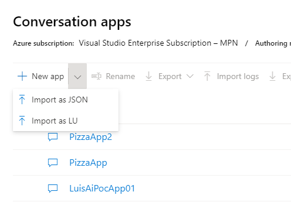
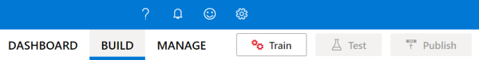
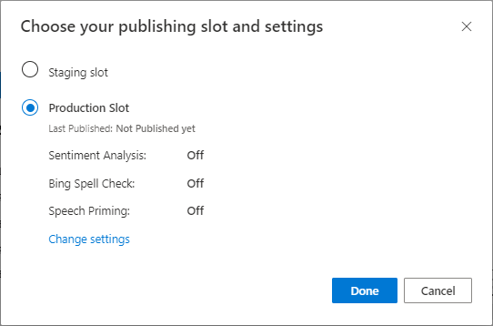
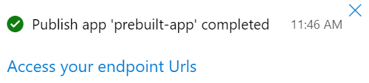

1. Select [demo-intents-luis.json](demo-intents-luis.json) to bring up the GitHub page for the `pizza-app-for-luis.json` file.
1. Right-click or long tap the **Raw** button and select **Save link as** to save the `pizza-app-for-luis.json` to your computer.
1. Sign into the [LUIS portal](https://www.luis.ai).
1. Select [My Apps](https://www.luis.ai/applications).
1. On the **My Apps** page, select **+ New app for conversation**.

   

1. Select **Import as JSON**.

   

1. In the **Import new app** dialog, select the **Choose File** button.
1. Select the `demo-intents-luis.json` file you downloaded, then select **Open**.
1. In the **Import new app** dialog **Name** field, enter a name for your Pizza app, then select the **Done** button.

The app will be imported.

If you see the dialog **How to create an effective LUIS app**, close the dialog.

## Train and publish the LUIS app

You should see the **Intents** page with a list of the intents in the LUIS app.

1. In the top-right side of the LUIS website, select the **Train** button.

   

1. Training is complete when status indicator on the **Train** button is green.

In order to receive a LUIS prediction in a chat bot or other client application, you need to publish the app to the prediction endpoint.

1. Select **Publish** in the top-right navigation.

   

1. Select the **Production** slot, then select **Done**.

   

1. Select **Access your endpoint URLs** in the notification to go to the **Azure Resources** page. You will only be able to see the URLs if you have a prediction resource associated with the app. You can also find the **Azure Resources** page by clicking **Manage**.

   

Your Pizza app is now ready to use.

## Record the app ID, prediction key, and prediction endpoint of your Pizza app

To use your new LUIS app, you will need the app ID, prediction key, and prediction endpoint of your LUIS app.

To find these values:

1. From the **Intents** page, select **MANAGE**.
1. From the **Application Settings** page, record the **App ID**.
1. Select **Azure Resources**.
1. From the **Azure Resources** page, record the **Primary Key**. This value is your prediction key.
1. Record the **Endpoint URL**. This value is your prediction endpoint.
