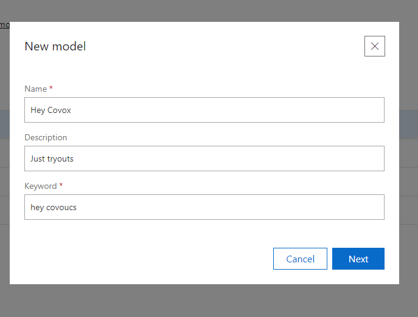
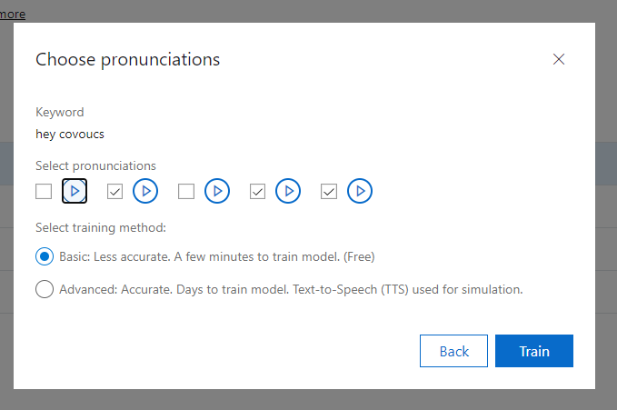

## Listening
### Keyword Recognition

#### Requirements
An Azure Cognitive Services Speech subscription key is required, or a multi-service subscription Azure Cognitive Services key.
Require to create the `Keyword model` configuration on [Azure Speech Studio](https://speech.microsoft.com/).

#### How it works
The SpeechStudio allows you to define a single `Keyword` per model. 
After you define the `Keyword` it prompts out a list of pronunciation sample to which you have to choose the ones having the sound that match your keyword speech.

After a `Keyword` speech model is trained it can be downloaded in a form of `.table` file, 
and that model file will feed the SpeechRecognizer when it starts the `KeyWordRecognizer`.
